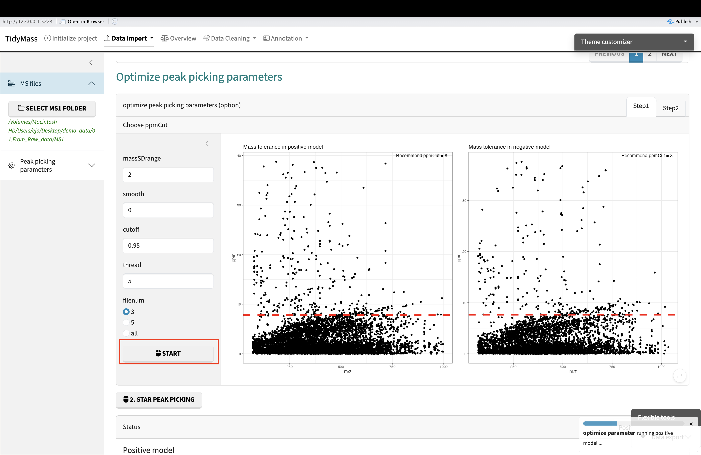
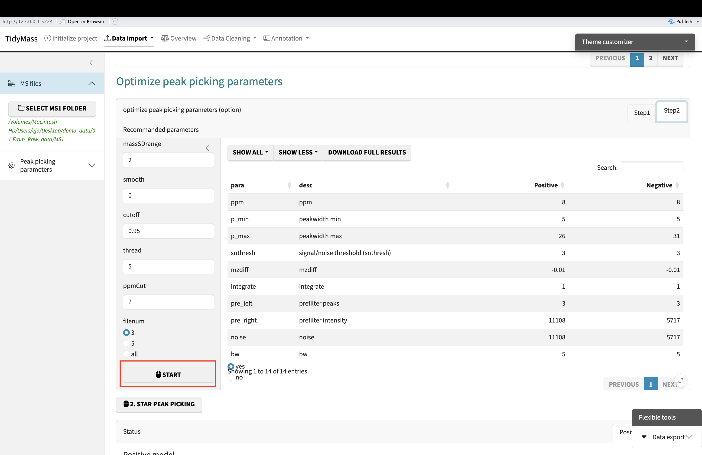

# Upstream data processing

To perform multiple analysis with tidymass shinyapp, you need to upload files first, the demo data can be downloaded through [Google Drive](https://drive.google.com/file/d/10OmQjZApoqJcd163X5C67pij2yZGWHnF/view?usp=sharing){target="_blank"} or [BaiduNetdisk](https://pan.baidu.com/s/1QfwGN29dJ5mxtKmKUBo9NA?pwd=iacm){target="_blank"}.

## Data format converter

If your data is in raw format, you may first convert it to .mzML or .mzXML format using [ProteoWizard](https://proteowizard.sourceforge.io){target="_blank"}. Please note that ProteoWizard only support Windows OS, you may consider [massconverter](https://massconverter.tidymass.org){target="_blank"} if you don't use Windows OS.

You can refer to the following parameter settings for ProteoWizard.

## Methods to upload the files

To begin with, you need to set up the working directory and upload the required files. Here we have three options to upload the files.

**Start with Ms file**: 
If you have raw data in the format like .mzML or mzXML. You can click on ‘Start with Ms file’ to upload the file.

**Start with table file**: If your data is a post-peak metabolite expression matrix, you can click on the ‘Start with table file’ button to upload the data. The sample table is as follows, and the first four columns must exist, with column names not to be changed. 

**Start with massdataset object**: If your data is generated by tidymass, you can choose the ‘Start with massdataset object’ button and directly upload them.

## Project initiate

Here are the steps you need to follow to initiate the project:

1. Set working directory
2. Upload sample_info.csv file
3. You may click the dropdown button and adjust the column names if there are any changes for them.
4. Click "INITIALIZE PROJECT" button and check the sample information.

## Data import

**Upload Ms file**

Before import the data, please ensure that the files are well anranged. Here is an example:

Click the dropdown button **Data import** and select **Start with MS file**.

Then click **SELECT MS1 FOLDER** and choose the MS1 folder. Next, click **CHECK INPUT FILE** and you will see the number of files you have just uploaded.

If the files are ready for analysis, you can begin to optimize peak picking parameters. The first step is to choose the ppmCut.

And the second step is to run with the ppmCut. (need to scroll down to find the button)

Finally, click **START PEAK PICKING** and get the results.

**Upload table file**

Click the dropdown button **Data import** and select **Start with table file**.

Then click **BROWSE** and select the csv table. Next, click **INPUT FILE SUMMARY** and you will see a summary of input file. If all the check have passed, then click **GENERATE MASSDATASET OBJECT** to obtain massdataset objects for both positive and negative modes.

**Upload table file**

If you already have massdataset objects generated by tidymass, you can simply upload them in this way. Seperately upload object for positive and negative mode and click **CKECK INPUT**

## Data quaily assessment

To have an overall understanding and assessment about the data, you can select **Overview** and click **START** to generate plots.

## Data cleaning

Before metabolite annotation, it's necessary to perform **data cleaning**.

**Remove noisy metabolic features**

The first step is removing noisy metabolic features. Here we choose to remove variables which have MVs in more than 20% QC samples and in at lest 50% samples in control group or case group, so the **MV cutoff of QC samples (%)** has been set as 20 and **MV cutoff (%)** has been set as 50.

Click **START** and **SHOW PLOT** to see the results.

**Filter outlier samples**

First, click **START** above to show the plots. Then click **START** below to filter outlier samples

**Missing value imputation**

Click **START** to perform missing value imputation

**Data normalization and integration**

Click **START** to perform the normalization and integration. Then click **SHOW PLOT** to visualize the difference before and after the normalization.

