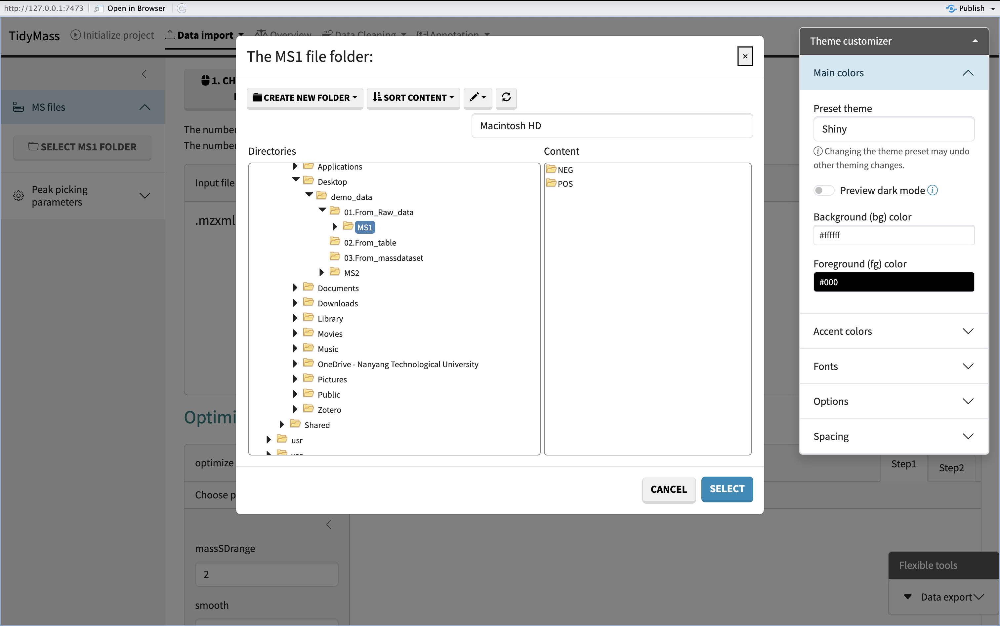

# Upstream data processing

To perform multiple analysis with tidymass shinyapp, you need to upload files first, the demo data can be downloaeded [here](https://drive.google.com/file/d/1bVDtNdK2gKZd39CpeXOStS2-WGDOStvs/view?usp=sharing).

## Methods to upload the files

To begin with, you need to set up the working directory and upload the required files. Here we have three options to upload the files.

**Start with Ms file**: If your data is in raw format, you may first convert it to .mgf format using HPC_tidymass. Then click on ‘Start with Ms file’ to upload the file.

**Start with table file**: If your data is a post-peak metabolite expression matrix, you can click on the ‘Start with table file’ button to upload the data. The sample table is as follows, and the first four columns must exist, with column names not to be changed. 

**Start with massdataset object**: If your data is generated by tidymass, you can choose the ‘Start with massdataset object’ button to upload your data as below.

