# Upstream data processing

To perform multiple analysis with Tidymass shinyapp, you need to upload files first, the demo data can be downloaded through [Google Drive](https://drive.google.com/file/d/1ATlQH46uJ55sOu6B-kCrlQJFkkS4W8KF/view?usp=sharing){target="_blank"} or [BaiduNetdisk](https://pan.baidu.com/s/1Sc2gcifJRurrgRkcDBlvEQ?pwd=393b){target="_blank"}.

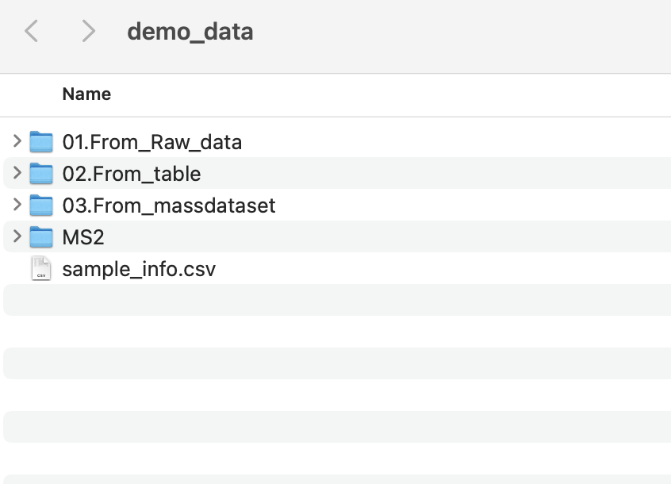

## Data format converter

If your data is in raw format, you may first convert it to .mzML or .mzXML format using [ProteoWizard](https://proteowizard.sourceforge.io){target="_blank"}. Please note that ProteoWizard only support Windows OS, you may consider [massconverter](https://massconverter.tidymass.org){target="_blank"} if you don't use Windows OS.

You can refer to the following parameter settings for ProteoWizard.

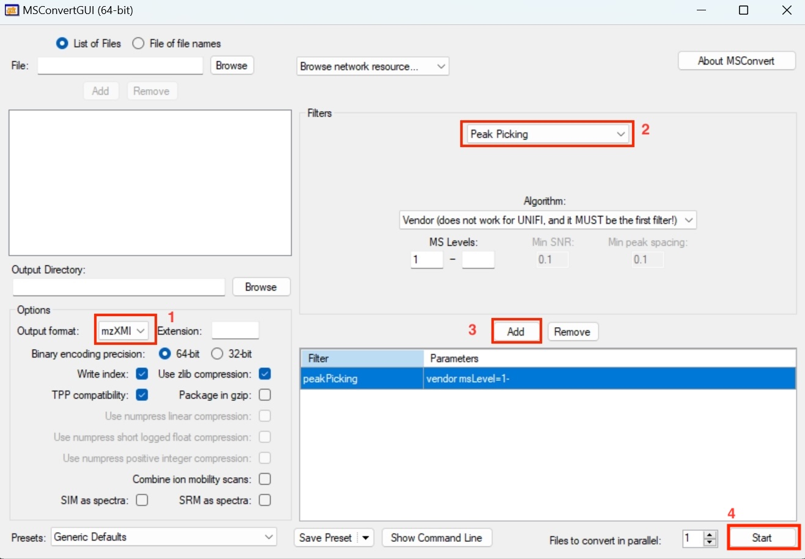

## Methods to upload the files

To begin with, you need to set up the working directory and upload the required files. Here we provide three options to do that.

**Start with Ms file**: 
If you have raw data in the format like .mzML or mzXML. You can click on ‘Start with Ms file’ to upload the file.

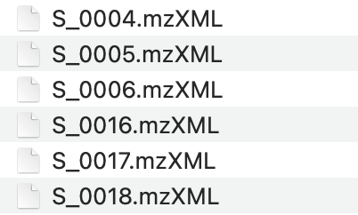

**Start with table file**: If your data is a post-peak metabolite expression matrix, you can click on the ‘Start with table file’ button to upload the data. The sample table is as follows, and the first four columns must exist, with column names not to be changed. 

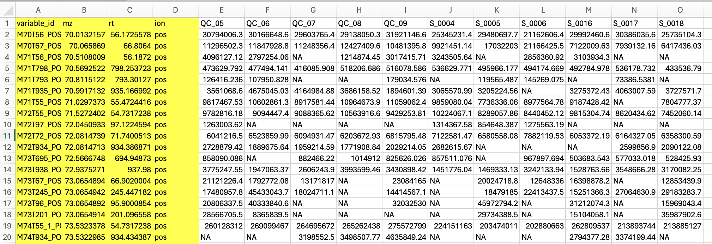

**Start with massdataset object**: If your data is generated by Tidymass, you can choose the ‘Start with massdataset object’ button and directly upload them.

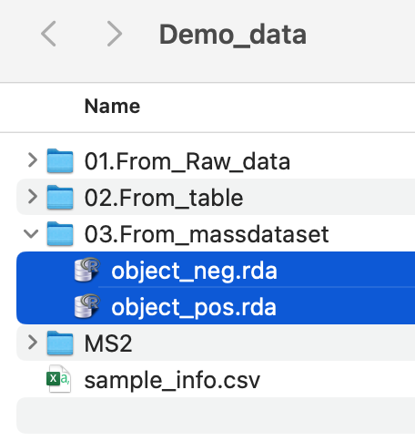

## Project initiate

Here are the steps you need to follow to initiate the project:

1. Set working directory
2. Upload `sample_info.csv` file
3. You may click the dropdown button and adjust the column names if there are any changes for them.
4. Click "Initialize Project" button and check the sample information.

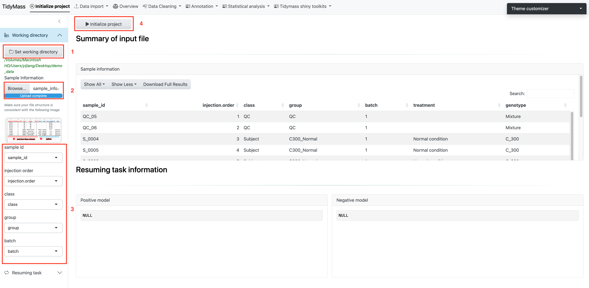

## Data import

**Upload Ms file**

Before importing the data, please make sure the files are properly organized according to sample type, such as `QC` and `Subject`. Here is an example:

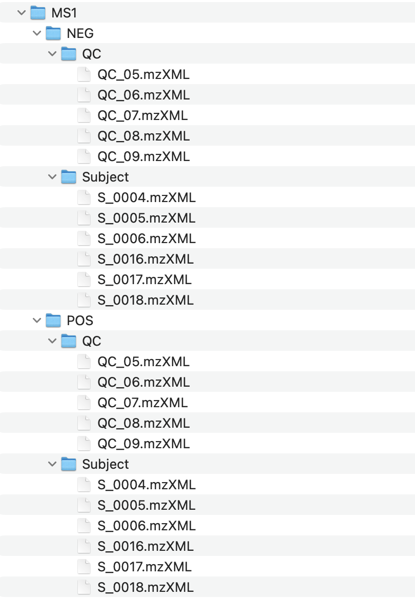

Click the dropdown button **Data import** and select **Start with MS file**.

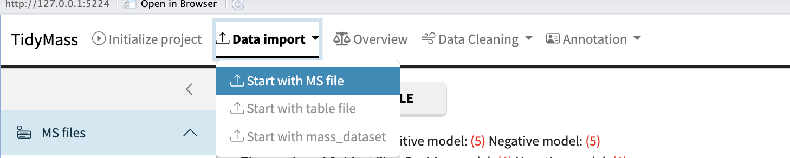

Then click **SELECT MS1 FOLDER** and choose the MS1 folder. 

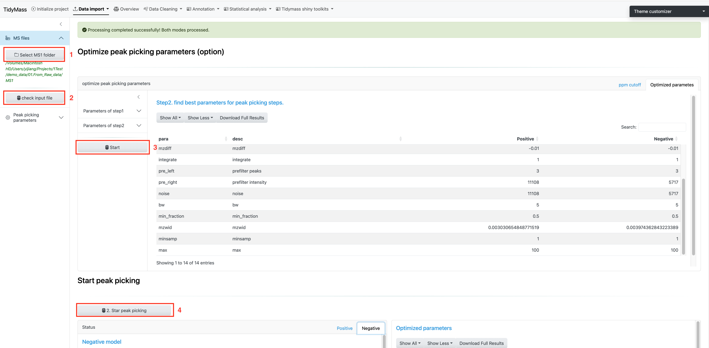

Next, click **CHECK INPUT FILE** and a prompt will appear if the files have been successfully uploaded.

After the files are ready for analysis, you can choose to set peak picking parameters yourself. Here are some important parameters:

* ppm: Peak detection ppm.
* peakwidth: Peak width. It is dependent on your column and LC system. 
* snthresh: Signal to noise threshold.
* noise: Noise cutoff.
* threads: The core number for performing.

For more details, please refer to [massprocesser](https://www.tidymass.org/massprocesser/articles/raw_data_processing.html){target="_blank"}.

If you want to use the recommended parameters, just click **Start** to proceed with further optimization (This may take a long time, please be patient). This will find the best ppm cutoff and run with it to perform the optimization.

Finally, click **Start peak picking** and get the results.

**Upload table file**

Click the dropdown button **Data import** and select **Start with table file**.

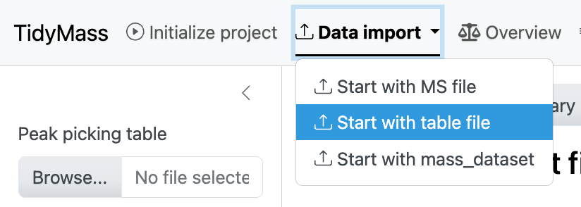

Then click **BROWSE** and select the csv table. Next, click **INPUT FILE SUMMARY** and you will see the statistics of input file, such as `QC Samples`, `Subject Samples` and `Total Features`.

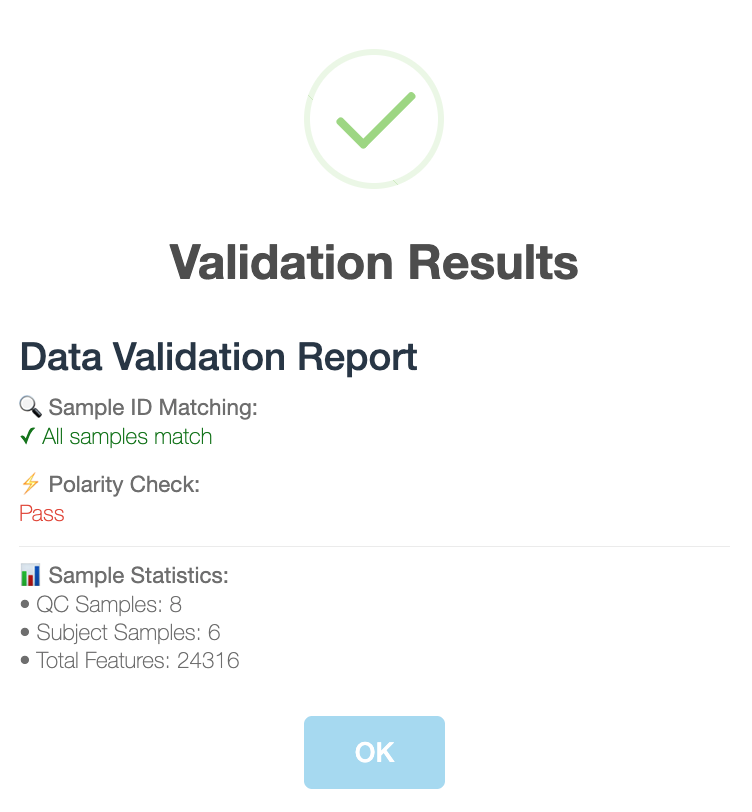

If all the check have passed, click **Generate massdataset object** to obtain massdataset objects for both positive and negative modes.

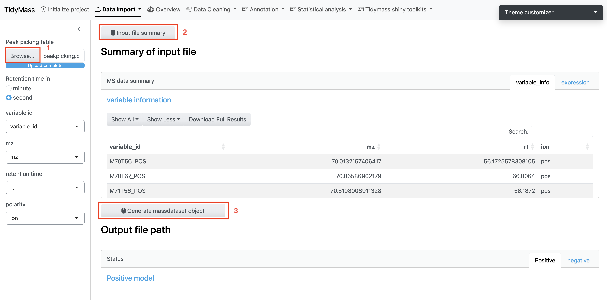

**Upload mass_dataset file**

If you already have massdataset objects generated by Tidymass, you can simply upload them. Upload objects for positive and negative modes separately and click **Check input**

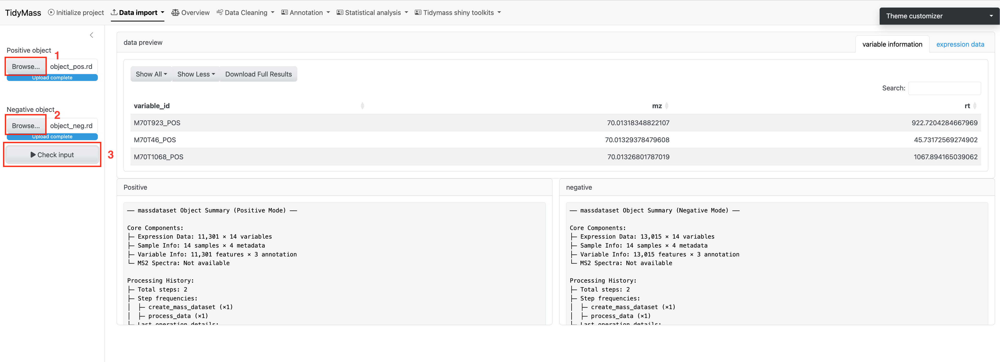

## Data quality assessment

To have an overall understanding and assessment of the data, you can select **Overview** and click **START** to generate multiple plots, including peak distribution, missing value summary and missing value in samples etc.

Here you can also adjust parameters and download these plots.

**Meaning of generated plots**

* Peak distribution: The distribution of detected metabolic features across retention time and m/z, with point size indicating feature intensity.
* Check missing value: The percentage of missing values across all samples and variables.
* Missing value in samples: The percentage of missing values in samples.
* Missing value in variables: The percentage of missing values in variables.

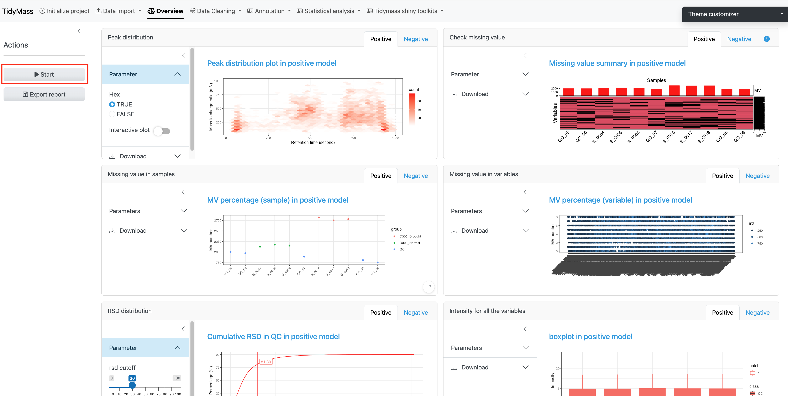

* RSD distribution: The percentage of features in QC samples with relative standard deviations (RSD) below given thresholds, here the **rsd cutoff** defaults to 30% and can be adjusted.
* Intensity for all the variables: The distribution of intensities across all variables for each sample.
* PCA: PCA plot of the dataset, which can be colored by sample_id, injection_order and batch etc.
* Sample correlation: The correlation score between different groups, here three correlation methods can be selected: spearman, kendall and pearson.

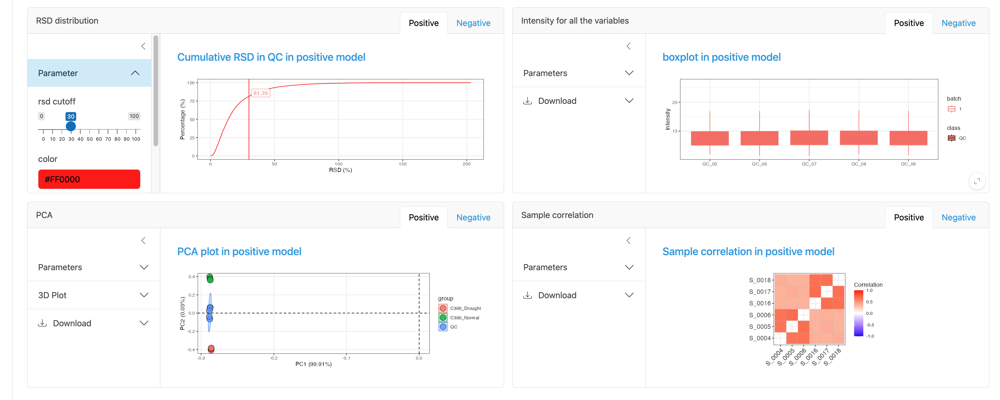

## Data cleaning

Before metabolite annotation, it's necessary to perform **data cleaning** as various bias may exist in sample preparation and data acquisition. It can be divided into different steps such as noisy feature removal and outlier samples removal. For more details, please refer to [masscleaner](https://masscleaner.tidymass.org/){target="_blank"}.

**Remove noisy metabolic features**

The first step is removing noisy metabolic features. Here we choose to remove variables who have MV in more than 20% QC samples and in at lest 50% samples in control group or case group, so the **MV cutoff of QC samples (%)** has been set as 20 and **MV cutoff (%)** has been set as 50. 

Click **Start** to remove these noisy metabolites.

Next, you can visualize the MV percentage of samples for `QC group`, `Subject group` or both of them by click **Show plot**.

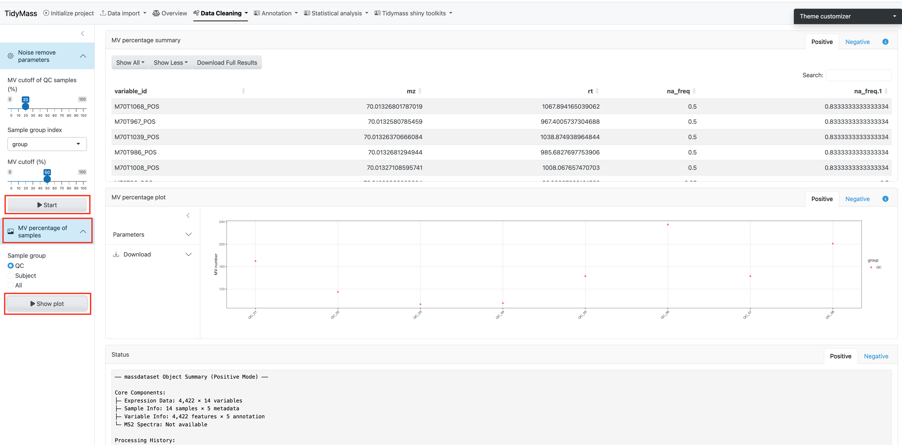

**Filter outlier samples**

When analyzing large cohorts, outlier samples can be a serious problem. In this step, we will filter these outlier samples. 

Before filtering outlier samples, you can click **Start** above to show the plot for Missing value in samples and PCA plot.

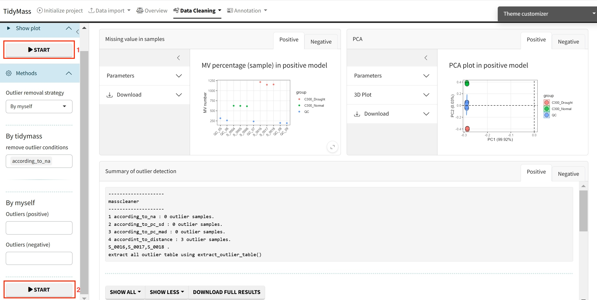

In Tidymass shinyapp, we provide multiple options to filter outliers, you may select different strategies according to your requirement. For more information, please refer to this [blog](https://privefl.github.io/blog/detecting-outlier-samples-in-pca/){target="_blank"}.

For "By tidymass" strategy, four remove outlier conditions are provided: according to NA (according_to_na), accoriding to standard deviation for principal component (pc_sd), according to mean abosolute deviation for principal component (pc_mad) and according to distance (according_to_distance). 

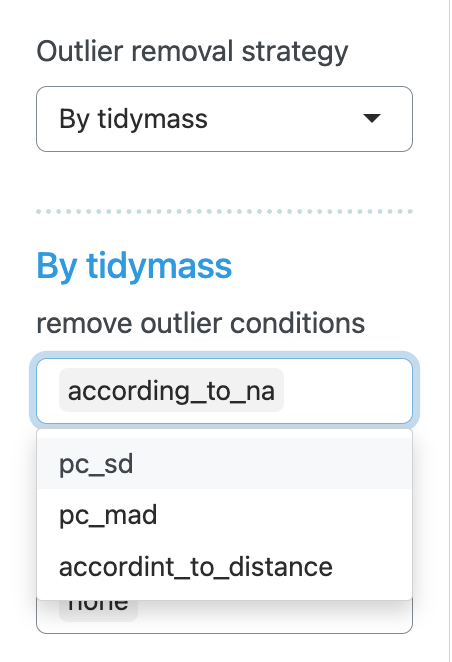

For "By myself" strategy, the outliers for both positive and negative modes are set to be "none". 

Click **Start** below to filter outlier samples.

**Missing value imputation**

Here you can select many different methods for missing value imputation, including knn, missforest (mf) and ppca etc. 

**Parameters**

For knn

* k: the parameters can be modified include number of neighbors. Defaults to 10.
* rowmax: maximum row missing proportion. Defaults to 0.5.
* colmax: maximum column missing proportion. Defaults to 0.8.
* maxp: maximum prediction proportion. Defaults to 1500.
* rng.seed: random number generator seed.

For missForest (rf)

* maxiter: the parameters include maximum iterations. Defaults to 10.
* ntree: number of trees. Defaults to 100.
* decreasing: whether to interpolate missing values in order from most to least number of missing values. Defaults to FALSE.

For ppca

* nPcs: the parameters can be modified include number of principal components. Defaults to 2.
* maxSteps: maximum steps for iterations. Defaults to 100.
* threshold: convergence threshold. Defaults to 1e-04.

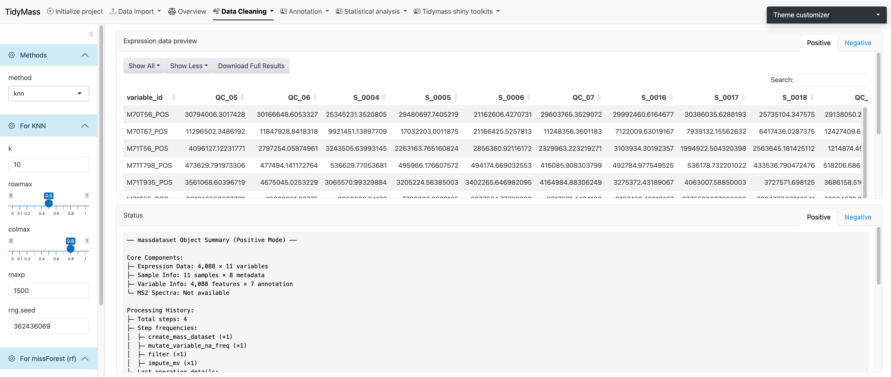

If the method has been chosen and all the parameters have been set, click **START** to perform missing value imputation.

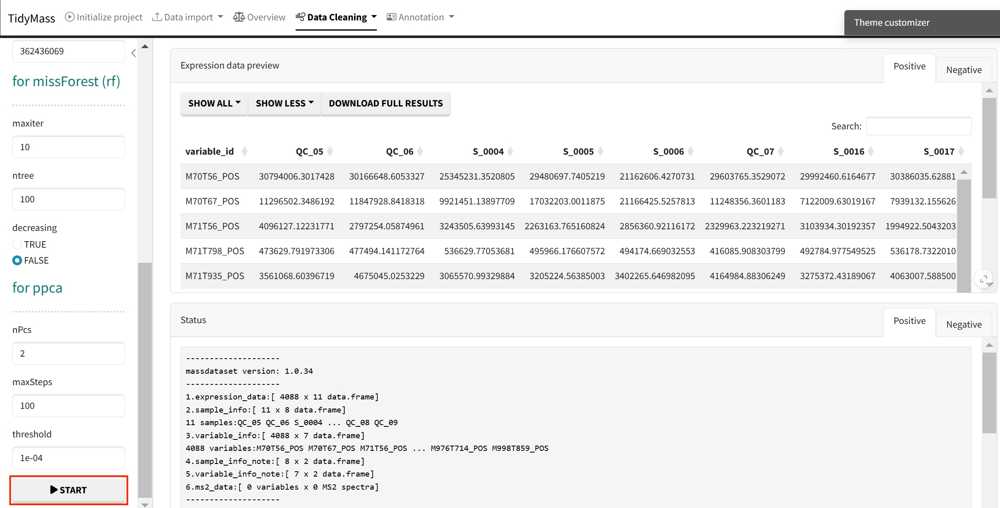

**Data normalization and integration**

To remove unwanted analytical variations and integrate multiple batches forming an integral data set for subsequent statistical analysis, we need to perform data normalization and integration.

Here we provide several methods to be selected, including QC sample-based data normalization like `svr` and `loess` and sample-wise method like `pqn`, `median`, `mean` and `total` intensity normalization.

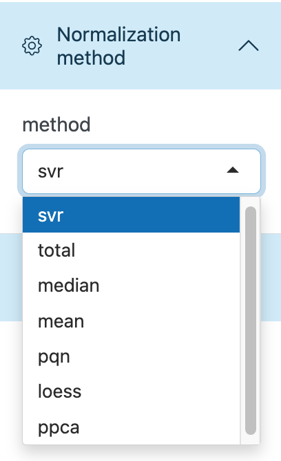

**Parameters**

* keep_scale: whether to keep the original scale of the data during the data standardization process. Defaults to TRUE.
* optimization: whether to enable optimization steps in the standardization process. Defaults to TRUE.
* pqn_reference: the reference value selected for using the Probabilistic Quotient Normalization method. Defaults to median.
* begin_value: the start value for parameter search range. Defaults to 0.5.
* end_value: the end value for parameter search range. Defaults to 1.
* step_value: the increment at each step of the parameter search. Defaults to 0.2.
* multiple: the standardized factors used to control multiples. Defaults to 1.
* threads: the number of threads for normalization. Defaults to 1.

Click **Start analysis** to perform the normalization and integration (The step may take some time, please be patient). Then click **Show plot** to visualize the difference before and after the normalization. 

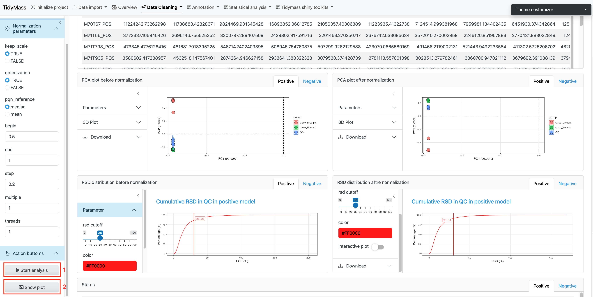

