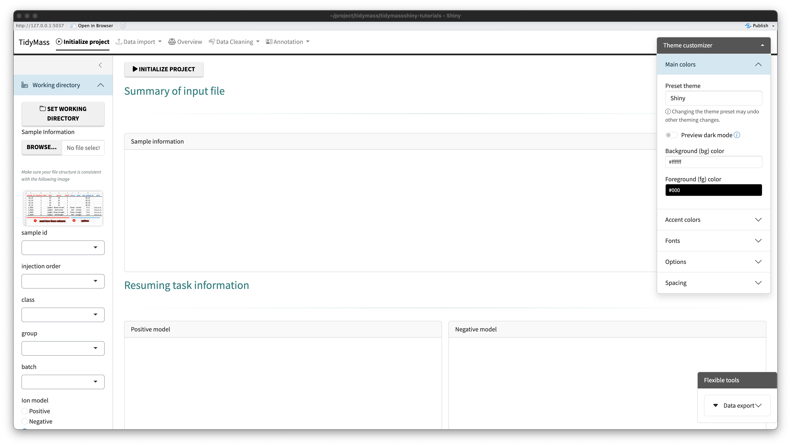

# Install tidymass shiny APP

## R package

You can find the source code of the package [here](https://github.com/tidymass/tidymass_shiny).

Use the below code to install the package.

```{r,eval=FALSE,warning=FALSE, R.options="", message=TRUE, cache=TRUE}
##> for chinese users:
##> options("repos" = c(CRAN="https://mirrors.tuna.tsinghua.edu.cn/CRAN/"))
##> options(BioC_mirror="https://mirrors.westlake.edu.cn/bioconductor")


if (!require('remotes')) install.packages('remotes');
if (!require('tidyverse')) install.packages('tidyverse');
if (!require('tidymass')) {
  source("https://www.tidymass.org/tidymass-packages/install_tidymass.txt");
  install_tidymass(from = "tidymass.org")
};
if (!require('shinyFiles')) remotes::install_github('thomasp85/shinyFiles');
if (!require('shinyWidgets')) remotes::install_github("dreamRs/shinyWidgets");
if (!require('shiny')) install.packages('shiny');
if (!require('bsicons')) install.packages('bsicons');
if (!require('bslib')) install.packages('bslib');
if (!require('plotly')) install.packages('plotly');
if (!require('colourpicker')) install.packages('colourpicker');
if (!require('plantmdb')) remotes::install_github("xuebinzhang-lab/plantmdb")  ## plant metabolomics database. for test use.
if (!require('tidymassshiny')) remotes::install_github('tidymass/tidymass_shiny')
```

## Start tidymass shiny APP

```{r,eval=FALSE,warning=FALSE, R.options="", message=TRUE, cache=TRUE}
run_tidymass_shiny()
```

The tidymass shiny App will start like below shows:




