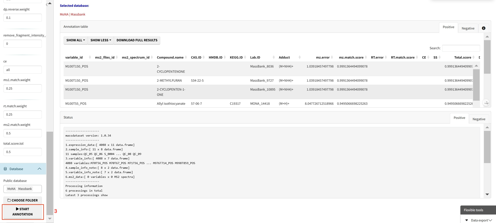

# Downstream data processing

## Metabolite annotation

Metabolite annotation can be performed based on in-house and available open-source databases. To begin with, you need to click **SELECT MS2 FOLDER** and import prepared MS2 data. These files should be in the format of ".mgf", and they should be stored separately for negative and positive modes.

Here are also some parameters can be modified: a character vector specifying the column types. Default is "rp" (column), numeric, the m/z tolerance for matching MS1 and MS2. Default is 15 (ms1.ms2.match.mz.tol), numeric, the retention time tolerance for matching MS1 and MS2. Default is 30 (ms1.ms2.match.rt.tol).

Once you have set the parameters, click **START**.

Next, you can choose annotation parameters: A numeric value specifying the mass accuracy threshold for MS1 matching in parts per million (ppm). Defaults to 25 (ms1.match.ppm), A numeric value specifying the mass accuracy threshold for MS2 (Fragment ion) matching in ppm. Defaults to 30 (ms2.match.ppm), A numeric value specifying the retention time matching tolerance in seconds. Defaults to 30 (rt.match.tol), A numeric value specifying the number of top candidates to retain per feature. Defaults to 3 (candidate.num), A character string specifying the chromatographic column type, either "rp" (reverse phase) or "hilic". Defaults to "rp" (column), An integer specifying the number of threads to use for parallel processing. Defaults to 3 (threads).

.

We also need necessary MS2 databases for metabolite annotation, you may download these databases from [metid website](https://www.tidymass.org/metid/articles/public_databases.html){target="_blank"}. You can also use Tidymass to build your own database, but please be noted that the format should be in ".rda".

After the download is complete, place them in a new folder and click **CHOOSE FOLDER**.

Here we also provide some public databases and you can simply select them to perform annotation without downloading anything.

## Annotation filtering

Click **Adduct for level 3 annotation** and then click **START** to perform annotation filtering.

## Origin analysis (to be done)

