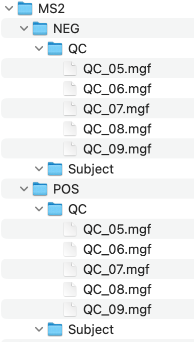
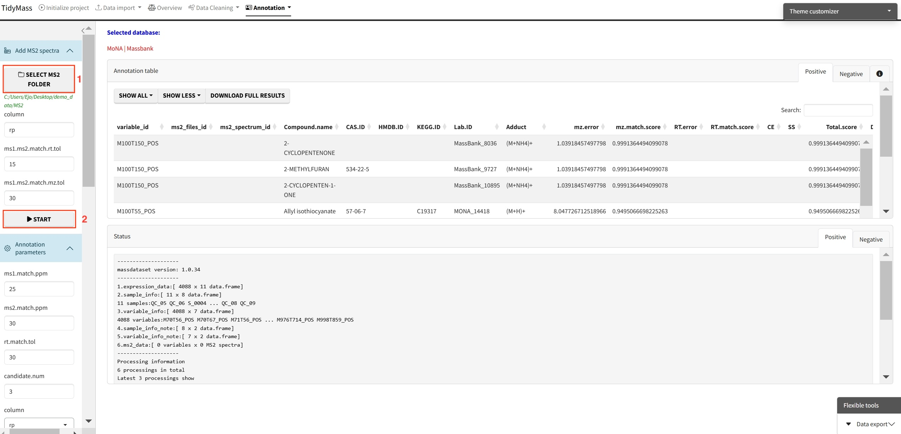
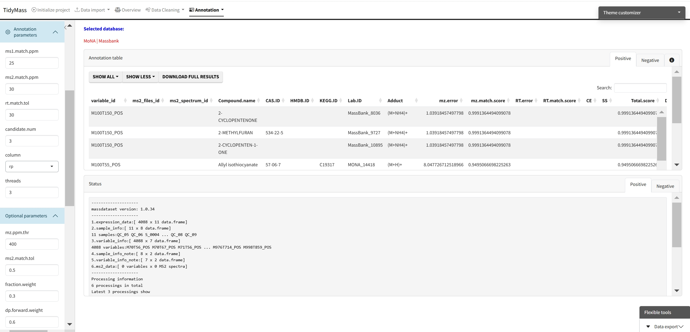

# Downstream data processing

## Metabolite annotation

Metabolite annotation can be performed based on in-house and available open-source databases. To begin with, you need to click **Select MS2 folder** and import prepared MS2 data. These files should be in the format of ".mgf", and they should be stored separately for negative and positive modes.

**Parameters**

* column: A character vector specifying the column types. Default is "rp".
* ms1.ms2.match.mz.tol: Numeric, the m/z tolerance for matching MS1 and MS2. Default is 15.
* ms1.ms2.match.rt.tol: Numeric, the retention time tolerance for matching MS1 and MS2. Default is 30.

Once you have set the parameters, click **Start** to import MS2 data.

Next, you can choose suitable parameters for metabolite annotation.

**Parameters**

* ms1.match.ppm: A numeric value specifying the mass accuracy threshold for MS1 matching in parts per million (ppm). Defaults to 25.
* ms2.match.ppm: A numeric value specifying the mass accuracy threshold for MS2 (Fragment ion) matching in ppm. Defaults to 30.
* rt.match.tol: A numeric value specifying the retention time matching tolerance in seconds. Defaults to 30.
* candidate.num: A numeric value specifying the number of top candidates to retain per feature. Defaults to 3.
* column: A character string specifying the chromatographic column type, either "rp" (reverse phase) or "hilic". Defaults to "rp".
* threads: An integer specifying the number of threads to use for parallel processing. Defaults to 3.

We need necessary MS2 databases for metabolite annotation, and here we provide some common in-house databases such as Mona, Massbank and HMDB. 

More MS2 compound databases can be downloaded from [Tidymass Website](https://www.tidymass.org/databases/){target="_blank"}. After the download is complete, place them in a new folder and click **Choose folder**.

Click **Start annotation** to begin the job (The job will start about 10s after you click the button, don't click again!).

## Annotation filtering

The annotation results are assigned confidence levels according to MSI (in-house database, level 1; public MS2 database, level 2; MS1 database, level 3).

After obtaining annotation results, you can choose how to keep multiple annotations, how to remove redundancy and how to keep annotation levels.

Click **Adduct for level 3 annotation** and select suitable models and methods, then click **START** to perform annotation filtering.

## Metabolites origin

## Differential Accumulated Metabolites (DAM)

## Enrichment

## Feature-based Pathway Analysis (FPA)

