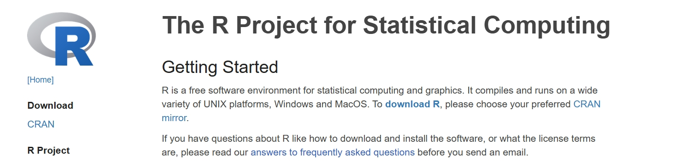
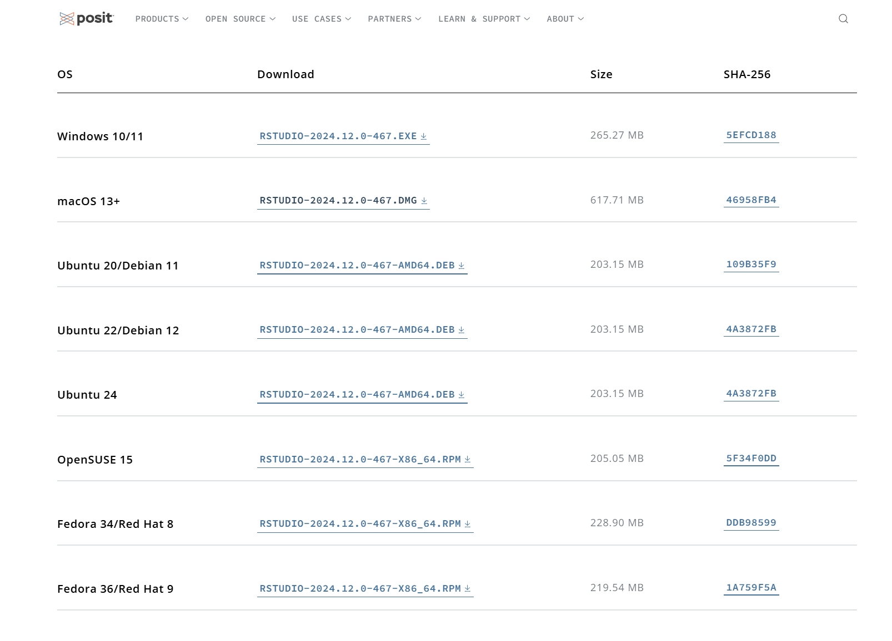
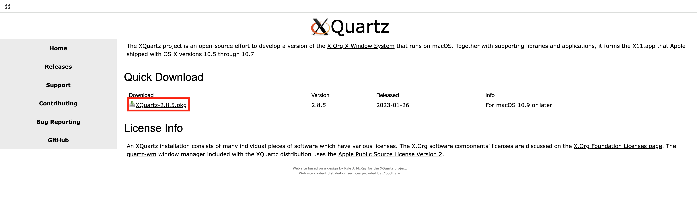
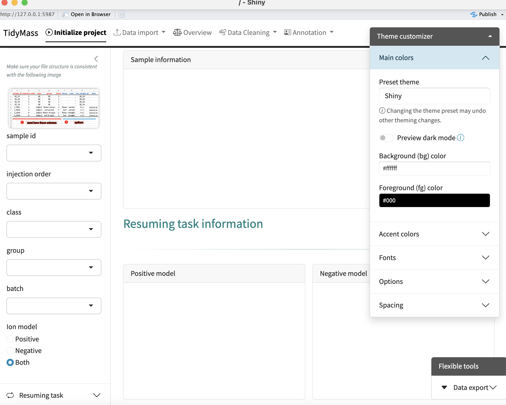

--- 
title: "Tutorials for Tidymass shinyapp"
site: bookdown::bookdown_site
documentclass: book
bibliography:
- book.bib
- packages.bib
description: |
  This is a minimal example of using the bookdown package to write a book.
  set in the _output.yml file.
  The HTML output format for this example is bookdown::gitbook,
link-citations: true
github-repo: "rstudio/bookdown-demo"
---

# Installation

[Tidymass shinyapp](https://github.com/tidymass/tidymass_shiny){target="_blank"} is a user-friendly web application for [Tidymass](https://www.tidymass.org/){target="_blank"} that requires little or no programming experience.

The app can only be installed via code now, and we will introduce how to do that step by step in this chapter.

## Install R and Rstudio

To begin with, you need to install R and Rstudio, both of which can be free downloaded from official websites.

If you have installed them before, please ensure that R version > 4.1 as tidymass required, ohterwise download and install the [latest version of R](https://cran.r-project.org/mirrors.html){target="_blank"}.

**Install R**

Download [R](https://www.r-project.org/){target="_blank"} and install it. 



**Install Rstudio**

Download [Rstudio](https://posit.co/download/rstudio-desktop/#download){target="_blank"} and install it.



**Open the Rstudio**


## (For Mac User) Install Cario

Cairo is a 2D graphics library used by R for high-quality plots and needed for Tidymass Shinyapp. On macOS, it requires the X11 system, which is not installed by default. You can follow the following steps if you haven't install Cairo.

First, visit the official website of [XQuartz](https://www.xquartz.org/){target="_blank"} and install it, and this will restart your computer.



Next, you can install **Cairo** by running the code in Rstudio:

```{r, eval=FALSE}
install.packages("Cairo", type = "source")
```

If the installation is successful, you should be able to library it:

```{r, eval=FALSE}
library(Cairo)
```

## Install Tidymass shinyapp

Here we provide three different methods to install tidymass shinyapp: **R**, **Docker** and **Server**.

**Install with R**

First, you are recommended to install **Tidymass** with the following code. For more information and guidance, please refer to [Tidymass Website](https://www.tidymass.org/){target="_blank"}

```{r, eval=FALSE}
remotes::install_gitlab("tidymass/tidymass")
```

Second, install the necessary packages:

```{r, eval=FALSE}
if (!require('remotes')) install.packages('remotes');
if (!require('tidyverse')) install.packages('tidyverse');
if (!require('writexl')) install.packages("writexl");
if (!require('hexbin')) install.packages('hexbin')
if (!require('ComplexUpset'))install.packages('ComplexUpset');
if (!require('shinyalert'))install.packages('shinyalert');
if (!require('shinyFiles')) remotes::install_github('thomasp85/shinyFiles');
if (!require('shinyWidgets')) remotes::install_github("dreamRs/shinyWidgets");
if (!require('shiny')) install.packages('shiny');
if (!require('bsicons')) install.packages('bsicons');
if (!require('bslib')) install.packages('bslib');
if (!require('plotly')) install.packages('plotly');
if (!require('colourpicker')) install.packages('colourpicker');
if (!require('massdbbuildin')) remotes::install_github('tidymass/massdbbuildin')
```

Finally, install Tidymass shinyapp with the code:

```{r, eval=FALSE}
remotes::install_github('tidymass/tidymass_shiny')
```


To start the Tidymass shinyapp:

```{r, eval=FALSE}
library(tidyverse)
library(tidymass)
library(tidymassshiny)
run_tidymass_shiny()
```

You should be able to see:



**Install with Docker**


**Install with Server**


