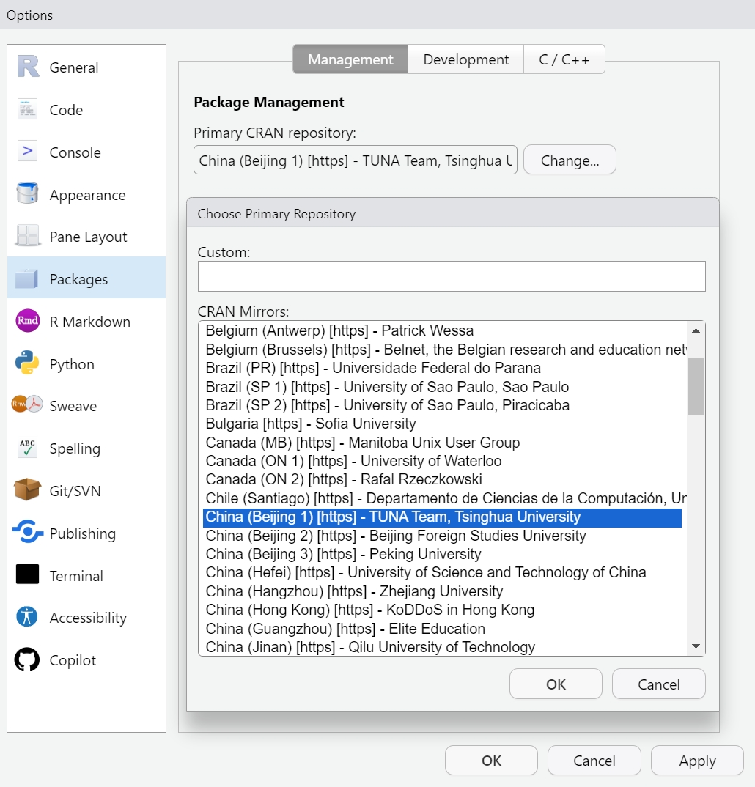

--- 
title: "Tutorials for tidymass shinyapp"

site: bookdown::bookdown_site
documentclass: book
bibliography: [book.bib, packages.bib]
# url: your book url like https://bookdown.org/yihui/bookdown
# cover-image: path to the social sharing image like images/cover.jpg
description: |
  This is a minimal example of using the bookdown package to write a book.
  The HTML output format for this example is bookdown::gitbook,
  set in the _output.yml file.
link-citations: yes
github-repo: rstudio/bookdown-demo
---

# Installation

**tidymass shinyapp** (https://github.com/tidymass/tidymass_shiny) is a user-friendly web application for **tidymass** (https://www.tidymass.org/) that requires little or no programming experience.

The app can only be installed via code now, and we will introduce how to do that step by step in this chapter.

## Preparations

To begin with, you need to install R and Rstudio, both of which can be free downloaded from official websites.

If you have installed them before, please ensure that R version > 4.1 as tidymass required, ohterwise download and install the [latest version of R](https://cran.r-project.org/mirrors.html).

**Install R**

Download [R](https://www.r-project.org/) and install it. 


**Install Rstudio**

Download [Rstudio](https://posit.co/download/rstudio-desktop/#download) and install it.


**Open the Rstudio**


**Setting up the suitable Mirror**

You may set up the suitable mirror to accelerate R package downloads.

Click "Tools" in the Rstudio, then click "Global options" and select "Packages". You may select mirror from TUNA Team if you are users from China.



**Install tidymass**

You are recommended to install [tidymass](https://www.tidymass.org/) according to the steps on the official website.


## Install tidymass shinyapp

You can render the HTML version of this example book without changing anything:

1. Find the **Build** pane in the RStudio IDE, and

1. Click on **Build Book**, then select your output format, or select "All formats" if you'd like to use multiple formats from the same book source files.

Or build the book from the R console:

```{r, eval=FALSE}
bookdown::render_book()
```

To render this example to PDF as a `bookdown::pdf_book`, you'll need to install XeLaTeX. You are recommended to install TinyTeX (which includes XeLaTeX): <https://yihui.org/tinytex/>.

## Preview book

As you work, you may start a local server to live preview this HTML book. This preview will update as you edit the book when you save individual .Rmd files. You can start the server in a work session by using the RStudio add-in "Preview book", or from the R console:

```{r eval=FALSE}
bookdown::serve_book()
```


```{r include=FALSE}
# automatically create a bib database for R packages
knitr::write_bib(c(
  .packages(), 'bookdown', 'knitr', 'rmarkdown'
), 'packages.bib')
```
